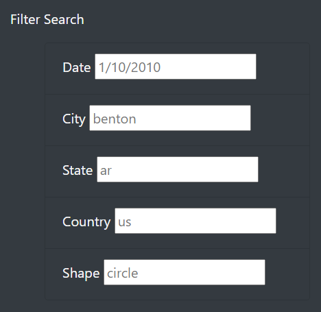

# UFOs

## Overview of Project
Client Dana requested that we build a website using HTML and Javascript that would be able to filter through data she had collected on UFO sightings. An initial app was created to import and display the data, then a function was created to iterate through the data and build it into a table, and finally an additional function was created to then filter the data. An HTML index was then created to display the table and its contents in a stylistic manner. Lastly, a filter interface was added so that users could input their own information to filter the data table.

## Results
The filter interface is fairly simple to use. As shown in the image below, there are input fields where users can enter their search criteria. 

After entering their criteria, all they have to do is click away from the input fields or press "Enter" and the data table will update with the filters applied.

The user is now free to view the filtered data table. They can perform additional searches by simply updating the input fields.
## Summary

### Potential Drawback(s)

A large drawback to this website is the specific inputs needed in order to display the data; everything must be lower case or it will not show up as shown in the images below with the search criteria "Benton" and then "benton."

In addition, the date format is 1/10/2010 as opposed to the commonly used 01/10/2010, which may cause confusion for some US residents, not to mention for international residents who might use the dd/mm/year format.

### Additional Recommendations
1)  If given more time to work on this project, I would want to fix the drawback mentioned above by either modifying the data to display in the proper format or to modify our code to allow for conditions that are CLOSE to the search term but not exact.
2) In addition, I would like to either reinstate the use of a button in order to simplify the execution of search results for users who many not know to press enter or click away from the filters, OR to update the code so that the data table updates in real time as the person is typing, without the need for them to press enter or click away.
